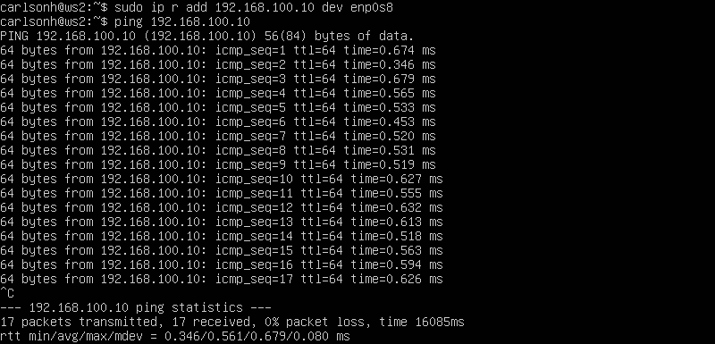
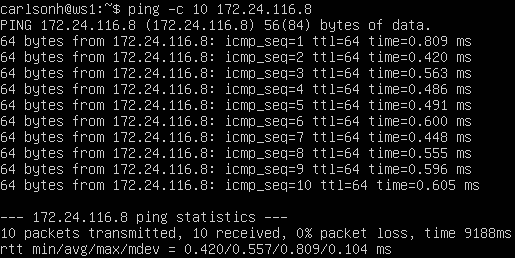
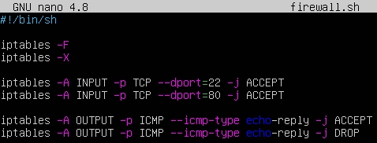
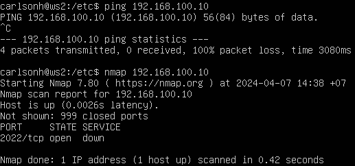
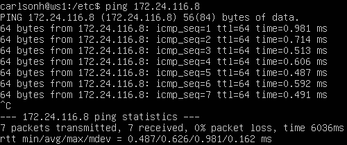

#### 1.1. Сети и маски
##### 1) Определить адрес сети *192.167.38.54/13*

- Определяю адрес сети, имея IP адрес и маску подсети:
- *192.167.38.54* -> *11000000.10100111.00100110.00110110*
- Маска *13* означает 13 единиц в двоичной записи маски.
- *\13* -> *11111111.11111000.00000000.00000000*
- Перевожу маску в десятичный вид: *255.248.0.0*
- Применю логическое И к маске и IP для получения адреса сети. Полученные данные вношу в таблицу:
	| IP            | Prefix  | Subnet Mask | Binary Representation of Subnet Mask | Network address |
	| ------------- | ------- | ----------- | ------------------------------------ | --------------- |
	| 192.167.38.54 | /13     | 255.248.0.0 | 11111111.11111000.00000000.00000000  | 192.160.0.0     |

##### 2) Перевод маски *255.255.255.0* в префиксную и двоичную запись, */15* в обычную и двоичную, *11111111.11111111.11111111.11110000* в обычную и префиксную

- Выполняю операции для перевода масок: 
	| Subnet Mask     | Prefix | Binary Representation of Subnet Mask |
	| --------------- | ------ | ------------------------------------ |
	| 255.255.255.0   | /24    | 11111111.11111111.11111111.00000000  |
	| 255.254.0.0     | /15    | 11111111.11111110.00000000.00000000  |
	| 255.255.255.240 | /28    | 11111111.11111111.11111111.11110000  |

##### 3) минимальный и максимальный хост в сети *12.167.38.4* при масках: */8*, *11111111.11111111.00000000.00000000*, *255.255.254.0* и */4*

- Поиск минимального и максимального хоста для сети *12.167.38.4*
- Выполню операции перевода масок:
	| Mask № | Subnet Mask   | Prefix | Binary Representation of Subnet Mask |
	| ------ | ------------- | ------ | ------------------------------------ |
	| 1      | 255.0.0.0     | /8     | 11111111.00000000.00000000.00000000  |
	| 2      | 255.255.0.0   | /16    | 11111111.11111111.00000000.00000000  |
	| 3      | 255.255.254.0 | /23    | 11111111.11111111.11111110.00000000  |
	| 4      | 240.0.0.0     | /4     | 11110000.00000000.00000000.00000000  |

- Определяю для каждой маски максимальный и минимальный хост:
	| Mask № | Network        | Min. host   | Max. host      |
	| ------ | -------------- | ----------- | -------------- |
	| 1      | 12.167.38.4/8  | 12.0.0.1    | 12.255.255.254 |
	| 2      | 12.167.38.4/16 | 12.167.0.1  | 12.167.255.254 |
	| 3      | 12.167.38.4/23 | 12.167.38.1 | 12.167.39.254  |
	| 4      | 12.167.38.4/4  | 0.0.0.1     | 15.255.255.254 |     

#### 1.2. localhost
##### Можно ли обратиться к приложению, работающему на localhost, со следующими IP: *194.34.23.100*, *127.0.0.2*, *127.1.0.1*, *128.0.0.1*

- Составлю таблицу с определением принадлежности для каждого IP:
	| IP            | Description |
	| ------------- | ----------- |
	| 194.34.23.100 | Не является частью локальной сети, поэтому приложение, работающее на localhost, не сможет получить доступ к этому IP-адресу напрямую. |
	| 127.0.0.2     | Принадлежит диапазону адресов, зарезервированных для обратной петли (loopback), где 127.0.0.1 является стандартным IP-адресом localhost. Таким образом, приложение, работающее на localhost, сможет получить доступ к этому IP-адресу. |
	| 127.1.0.1     | Принадлежит диапазону адресов обратной петли и, как и предыдущий, доступен из приложения, работающего на localhost. |
	| 128.0.0.1     | Не является частью диапазона адресов обратной петли, поэтому приложение, работающее на localhost, не сможет напрямую получить доступ к нему. |

#### 1.3. Диапазоны и сегменты сетей
##### 1) какие из перечисленных IP можно использовать в качестве публичного, а какие только в качестве частных: *10.0.0.45*, *134.43.0.2*, *192.168.4.2*, *172.20.250.4*, *172.0.2.1*, *192.172.0.1*, *172.68.0.2*, *172.16.255.255*, *10.10.10.10*, *192.169.168.1*

- Публичные IP-адреса: Эти адреса используются в глобальной сети Интернет и должны быть уникальными. Общепринятые диапазоны публичных IP-адресов включают:
  - IP-адреса, не принадлежащие диапазонам частных IP.
  - Диапазоны IP, зарегистрированные и ассигнованные различным организациям и регистраторам.

- Частные IP-адреса: Эти адреса используются в частных сетях (например, в домашних сетях, внутренних сетях предприятий и т. д.). Общепринятые диапазоны частных IP-адресов включают:
  - Диапазон *10.0.0.0 - 10.255.255.255 (10.0.0.0/8)*
  - Диапазон *172.16.0.0 - 172.31.255.255 (172.16.0.0/12)*
  - Диапазон *192.168.0.0 - 192.168.255.255 (192.168.0.0/16)*

- С учетом данных, проверяю каждый из предоставленных IP-адресов:
	| IP             | Частный | Публичный |
	| -------------- | ------- | --------- |
	| 10.0.0.45      | +       |           |
	| 134.43.0.2     |         | +         |
	| 192.168.4.2    | +       |           |
	| 172.20.250.4   | +       |           |
	| 172.0.2.1      |         | +         |
	| 192.172.0.1    |         | +         |
	| 172.68.0.2     |         | +         |
	| 172.16.255.255 | +       |           |
	| 10.10.10.10    | +       |           |
	| 192.169.168.1  |         | +         |

##### 2) какие из перечисленных IP адресов шлюза возможны у сети *10.10.0.0/18*: *10.0.0.1*, *10.10.0.2*, *10.10.10.10*, *10.10.100.1*, *10.10.1.255*

- Сначала определяю диапазон адресов для сети *10.10.0.0/18*. *10.10.0.1 - 10.10.63.254*. Теперь проверяю каждый из предоставленных IP-адресов:
	| IP          | Статус |
	| ----------- | ------ |
	| 10.0.0.1    | -      |
	| 10.10.0.2   | +      |
	| 10.10.10.10 | +      |
	| 10.10.100.1 | -      |
	| 10.10.1.255 | +      |

## Part 2. Статическая маршрутизация между двумя машинами

##### С помощью команды `ip a` посмотреть существующие сетевые интерфейсы

- Вывод команды `ip a` на машинах:
  - *ws1*: \
   \
  *Вывод команды ip a* 

  - *ws2*: \
   \
  *Вывод команды ip a*

##### Описать сетевой интерфейс, соответствующий внутренней сети, на обеих машинах и задать следующие адреса и маски: ws1 - *192.168.100.10*, маска */16*, ws2 - *172.24.116.8*, маска */12*

- Захожу в файлы конфигурации *etc/netplan/00-installer-config.yaml* на каждой машине
- Прописываю статические адреса:
  - *ws1*: \
   \
  *Конфигурация IP*

  - *ws2*: \
   \
  *Конфигурация IP*

##### Выполнить команду `netplan apply` для перезапуска сервиса сети

- Применяю команду `netplan apply` на машинах:
  - *ws1*: \
   \
  *netplan apply*

  - *ws2*: \
   \
  *netplan apply*

#### 2.1. Добавление статического маршрута вручную

- Добавляю статические маршруты на машинах командой `sudo ip r add` и пингую друг до друга:
  - *ws1*: \
   \
  *Добавление маршрута и пинг*

  - *ws2*: \
   \
  *Добавление маршрута и пинг*

#### 2.2. Добавление статического маршрута с сохранением

- Перезапустил машины командой `sudo reboot`
- Захожу в файлы конфигурации *etc/netplan/00-installer-config.yaml* на каждой машине
- Прописываю статические маршруты:
  - *ws1*: \
   \
  *Добавление маршрута в файл конфигурации*

  - *ws2*: \
   \
  *Добавление маршрута в файл конфигурации*

##### Пропинговать соединение между машинами

- Пингую машины после сохранения конфигурации и применения `netplan apply`:
  - *ws1*: \
   \
  *Пинг после сохранения файла конфигурации*

  - *ws2*: \
   \
  *Пинг после сохранения файла конфигурации*


#### 3.1. Скорость соединения

*В данном задании используются виртуальные машины ws1 и ws2 из Части 2*

##### Перевести и записать в отчёт: 8 Mbps в MB/s, 100 MB/s в Kbps, 1 Gbps в Mbps
- Перевожу единицы измерения:
	- 8 Mbps = 1 MB/s
	- 100 MB/s = 800000 Kbps
	- 1 Gbps = 1000 Mbps

#### 3.2. Утилита **iperf3**

##### Измерить скорость соединения между ws1 и ws2

- Устанавливаю утилиту **iperf3**.
- Запускаю на одной из машин команду `iperf3 -s` \
 \
*Команада iperf3 -s на ws1*

- На второй подключаюсь к серверу командой `iperf3 -c [ip_addres]` \
 \
*Команада iperf3 -c на ws2*

## Part 4. Сетевой экран

#### 4.1. Утилита **iptables**

##### Создать файл */etc/firewall.sh*, имитирующий фаерволл, на ws1 и ws2:
##### Нужно добавить в файл подряд следующие правила:
##### 1) на ws1 применить стратегию когда в начале пишется запрещающее правило, а в конце пишется разрешающее правило (это касается пунктов 4 и 5)
##### 2) на ws2 применить стратегию когда в начале пишется разрешающее правило, а в конце пишется запрещающее правило (это касается пунктов 4 и 5)
##### 3) открыть на машинах доступ для порта 22 (ssh) и порта 80 (http)
##### 4) запретить *echo reply* (машина не должна "пинговаться”, т.е. должна быть блокировка на OUTPUT)
##### 5) разрешить *echo reply* (машина должна "пинговаться")

- Создаю файлы конфигурации firewall на машинах: \
 \
*Firewall conf ws1* \
 \
*Firewall conf ws2*

- Запускаю скрипты firewall: \
 \
*Firewall conf ws1* \
 \
*Firewall conf ws2*

- На ws1, где первым идет запрещающее правило, а затем разрешающее, пинг будет запрещен, потому что правило о блокировке ICMP трафика будет иметь приоритет над разрешающим правилом.
- На ws2, где первым идет разрешающее правило, а затем запрещающее, пинг будет разрешен, так как разрешающее правило будет применяться перед запрещающим, и любые попытки пинга будут разрешены.

#### 4.2. Утилита **nmap**

##### Командой **ping** найти машину, которая не "пингуется", после чего утилитой **nmap** показать, что хост машины запущен

*Проверка: в выводе nmap должно быть сказано: `Host is up`*
- В отчёт поместить скрины с вызовом и выводом использованных команд **ping** и **nmap**.

- Командой пинг проверяю, какая из машин не пингуется. Не пингуется ws1 из-за **firewall**. \
 \
*Отсутствие пинга и вывод nmap ws2 -> ws1* \
 \
*Пинг ws1 -> ws2* 

##### Сохранить дампы образов виртуальных машин

## Part 5. Статическая маршрутизация сети

`-` Пока что мы соединяли всего две машины, но теперь пришло время для статической маршрутизации целой сети.

**== Задание ==**

Сеть: \


##### Поднять пять виртуальных машин (3 рабочие станции (ws11, ws21, ws22) и 2 роутера (r1, r2))

#### 5.1. Настройка адресов машин
##### Настроить конфигурации машин в *etc/netplan/00-installer-config.yaml* согласно сети на рисунке.
- В отчёт поместить скрины с содержанием файла *etc/netplan/00-installer-config.yaml* для каждой машины.
##### Перезапустить сервис сети. Если ошибок нет, то командой `ip -4 a` проверить, что адрес машины задан верно. Также пропинговать ws22 с ws21. Аналогично пропинговать r1 с ws11.
- В отчёт поместить скрины с вызовом и выводом использованных команд.

#### 5.2. Включение переадресации IP-адресов.
##### Для включения переадресации IP, выполните команду на роутерах:
`sysctl -w net.ipv4.ip_forward=1`
*При таком подходе переадресация не будет работать после перезагрузки системы.*
- В отчёт поместить скрин с вызовом и выводом использованной команды.
##### Откройте файл */etc/sysctl.conf* и добавьте в него следующую строку:
`net.ipv4.ip_forward = 1`
*При использовании этого подхода, IP-переадресация включена на постоянной основе.*
- В отчёт поместить скрин с содержанием изменённого файла */etc/sysctl.conf*.

#### 5.3. Установка маршрута по-умолчанию
Пример вывода команды `ip r` после добавления шлюза:
```
default via 10.10.0.1 dev eth0
10.10.0.0/18 dev eth0 proto kernel scope link src 10.10.0.2
```
##### Настроить маршрут по-умолчанию (шлюз) для рабочих станций. Для этого добавить `default` перед IP роутера в файле конфигураций
- В отчёт поместить скрин с содержанием файла *etc/netplan/00-installer-config.yaml*.
##### Вызвать `ip r` и показать, что добавился маршрут в таблицу маршрутизации
- В отчёт поместить скрин с вызовом и выводом использованной команды.
##### Пропинговать с ws11 роутер r2 и показать на r2, что пинг доходит. Для этого использовать команду:
`tcpdump -tn -i eth1`
- В отчёт поместить скрин с вызовом и выводом использованных команд.

#### 5.4. Добавление статических маршрутов
##### Добавить в роутеры r1 и r2 статические маршруты в файле конфигураций. Пример для r1 маршрута в сетку 10.20.0.0/26:
```shell
# Добавить в конец описания сетевого интерфейса eth1:
- to: 10.20.0.0
  via: 10.100.0.12
```
- В отчёт поместить скрины с содержанием изменённого файла *etc/netplan/00-installer-config.yaml* для каждого роутера.
##### Вызвать `ip r` и показать таблицы с маршрутами на обоих роутерах. Пример таблицы на r1:
```
10.100.0.0/16 dev eth1 proto kernel scope link src 10.100.0.11
10.20.0.0/26 via 10.100.0.12 dev eth1
10.10.0.0/18 dev eth0 proto kernel scope link src 10.10.0.1
```
- В отчёт поместить скрин с вызовом и выводом использованной команды.
##### Запустить команды на ws11:
`ip r list 10.10.0.0/[маска сети]` и `ip r list 0.0.0.0/0`
- В отчёт поместить скрин с вызовом и выводом использованных команд.
- В отчёте объяснить, почему для адреса 10.10.0.0/\[маска сети\] был выбран маршрут, отличный от 0.0.0.0/0, хотя он попадает под маршрут по-умолчанию.

#### 5.5. Построение списка маршрутизаторов
Пример вывода утилиты **traceroute** после добавления шлюза:
```
1 10.10.0.1 0 ms 1 ms 0 ms
2 10.100.0.12 1 ms 0 ms 1 ms
3 10.20.0.10 12 ms 1 ms 3 ms
```
##### Запустить на r1 команду дампа:
`tcpdump -tnv -i eth0`
##### При помощи утилиты **traceroute** построить список маршрутизаторов на пути от ws11 до ws21
- В отчёт поместить скрины с вызовом и выводом использованных команд (tcpdump и traceroute).
- В отчёте, опираясь на вывод, полученный из дампа на r1, объяснить принцип работы построения пути при помощи **traceroute**.

#### 5.6. Использование протокола **ICMP** при маршрутизации
##### Запустить на r1 перехват сетевого трафика, проходящего через eth0 с помощью команды:
`tcpdump -n -i eth0 icmp`
##### Пропинговать с ws11 несуществующий IP (например, *10.30.0.111*) с помощью команды:
`ping -c 1 10.30.0.111`
- В отчёт поместить скрин с вызовом и выводом использованных команд.

##### Сохранить дампы образов виртуальных машин
**p.s. Ни в коем случае не сохранять дампы в гит!**

## Part 6. Динамическая настройка IP с помощью **DHCP**

`-` Следующим нашим шагом будет более подробное знакомство со службой **DHCP**, которую ты уже знаешь.

**== Задание ==**

*В данном задании используются виртуальные машины из Части 5*

##### Для r2 настроить в файле */etc/dhcp/dhcpd.conf* конфигурацию службы **DHCP**:
##### 1) указать адрес маршрутизатора по-умолчанию, DNS-сервер и адрес внутренней сети. Пример файла для r2:
```shell
subnet 10.100.0.0 netmask 255.255.0.0 {}

subnet 10.20.0.0 netmask 255.255.255.192
{
    range 10.20.0.2 10.20.0.50;
    option routers 10.20.0.1;
    option domain-name-servers 10.20.0.1;
}
```
##### 2) в файле *resolv.conf* прописать `nameserver 8.8.8.8.`
- В отчёт поместить скрины с содержанием изменённых файлов.
##### Перезагрузить службу **DHCP** командой `systemctl restart isc-dhcp-server`. Машину ws21 перезагрузить при помощи `reboot` и через `ip a` показать, что она получила адрес. Также пропинговать ws22 с ws21.
- В отчёт поместить скрины с вызовом и выводом использованных команд.

##### Указать MAC адрес у ws11, для этого в *etc/netplan/00-installer-config.yaml* надо добавить строки: `macaddress: 10:10:10:10:10:BA`, `dhcp4: true`
- В отчёт поместить скрин с содержанием изменённого файла *etc/netplan/00-installer-config.yaml*.
##### Для r1 настроить аналогично r2, но сделать выдачу адресов с жесткой привязкой к MAC-адресу (ws11). Провести аналогичные тесты
- В отчёте этот пункт описать аналогично настройке для r2.
##### Запросить с ws21 обновление ip адреса
- В отчёте поместить скрины ip до и после обновления.
- В отчёте описать, какими опциями **DHCP** сервера пользовались в данном пункте.

##### Сохранить дампы образов виртуальных машин
**p.s. Ни в коем случае не сохранять дампы в гит!**

## Part 7. **NAT**
`-` Ну и, наконец, в качестве вишенки на торте, я расскажу тебе про механизм преобразования адресов.

**== Задание ==**

*В данном задании используются виртуальные машины из Части 5*
##### В файле */etc/apache2/ports.conf* на ws22 и r1 изменить строку `Listen 80` на `Listen 0.0.0.0:80`, то есть сделать сервер Apache2 общедоступным
- В отчёт поместить скрин с содержанием изменённого файла.
##### Запустить веб-сервер Apache командой `service apache2 start` на ws22 и r1
- В отчёт поместить скрины с вызовом и выводом использованной команды.
##### Добавить в фаервол, созданный по аналогии с фаерволом из Части 4, на r2 следующие правила:
##### 1) удаление правил в таблице filter - `iptables -F`
##### 2) удаление правил в таблице "NAT" - `iptables -F -t nat`
##### 3) отбрасывать все маршрутизируемые пакеты - `iptables --policy FORWARD DROP`
##### Запускать файл также, как в Части 4
##### Проверить соединение между ws22 и r1 командой `ping`
*При запуске файла с этими правилами, ws22 не должна "пинговаться" с r1*
- В отчёт поместить скрины с вызовом и выводом использованной команды.
##### Добавить в файл ещё одно правило:
##### 4) разрешить маршрутизацию всех пакетов протокола **ICMP**
##### Запускать файл также, как в Части 4
##### Проверить соединение между ws22 и r1 командой `ping`
*При запуске файла с этими правилами, ws22 должна "пинговаться" с r1*
- В отчёт поместить скрины с вызовом и выводом использованной команды.
##### Добавить в файл ещё два правила:
##### 5) включить **SNAT**, а именно маскирование всех локальных ip из локальной сети, находящейся за r2 (по обозначениям из Части 5 - сеть 10.20.0.0)
*Совет: стоит подумать о маршрутизации внутренних пакетов, а также внешних пакетов с установленным соединением*
##### 6) включить **DNAT** на 8080 порт машины r2 и добавить к веб-серверу Apache, запущенному на ws22, доступ извне сети
*Совет: стоит учесть, что при попытке подключения возникнет новое tcp-соединение, предназначенное ws22 и 80 порту*
- В отчёт поместить скрин с содержанием изменённого файла.
##### Запускать файл также, как в Части 4
*Перед тестированием рекомендуется отключить сетевой интерфейс **NAT** (его наличие можно проверить командой `ip a`) в VirtualBox, если он включен*
##### Проверить соединение по TCP для **SNAT**, для этого с ws22 подключиться к серверу Apache на r1 командой:
`telnet [адрес] [порт]`
##### Проверить соединение по TCP для **DNAT**, для этого с r1 подключиться к серверу Apache на ws22 командой `telnet` (обращаться по адресу r2 и порту 8080)
- В отчёт поместить скрины с вызовом и выводом использованных команд.

##### Сохранить дампы образов виртуальных машин
**p.s. Ни в коем случае не сохранять дампы в гит!**

## Part 8. Дополнительно. Знакомство с **SSH Tunnels**

`-` Пожалуй, на этом у меня всё. Может у тебя появились ещё какие-то вопросы?

`-` Да, я хотел спросить ещё об одной вещи. На работе я краем уха услышал, что в моей компании есть некие проекты по обучению. Подробностей я не знаю, но очень хочется взглянуть... Вдруг будет полезно

`-` Действительно интересно, но как в этом помогу тебе я?

`-` Дело в том, что, чтобы добраться до этих проектов, нужно получить доступ к закрытой сети. Можешь посоветовать что-нибудь по этому поводу?

`-` Ну ты, конечно, даёшь... Не уверен на все сто, что это поможет, но могу рассказать тебе про **SSH Tunnels**.

**== Задание ==**

*В данном задании используются виртуальные машины из Части 5*

##### Запустить на r2 фаервол с правилами из Части 7
##### Запустить веб-сервер **Apache** на ws22 только на localhost (то есть в файле */etc/apache2/ports.conf* изменить строку `Listen 80` на `Listen localhost:80`)
##### Воспользоваться *Local TCP forwarding* с ws21 до ws22, чтобы получить доступ к веб-серверу на ws22 с ws21
##### Воспользоваться *Remote TCP forwarding* c ws11 до ws22, чтобы получить доступ к веб-серверу на ws22 с ws11
##### Для проверки, сработало ли подключение в обоих предыдущих пунктах, перейдите во второй терминал (например, клавишами Alt + F2) и выполните команду:
`telnet 127.0.0.1 [локальный порт]`
- В отчёте описать команды, необходимые для выполнения этих четырёх пунктов, а также приложить скриншоты с их вызовом и выводом.

##### Сохранить дампы образов виртуальных машин
**p.s. Ни в коем случае не сохранять дампы в гит!**